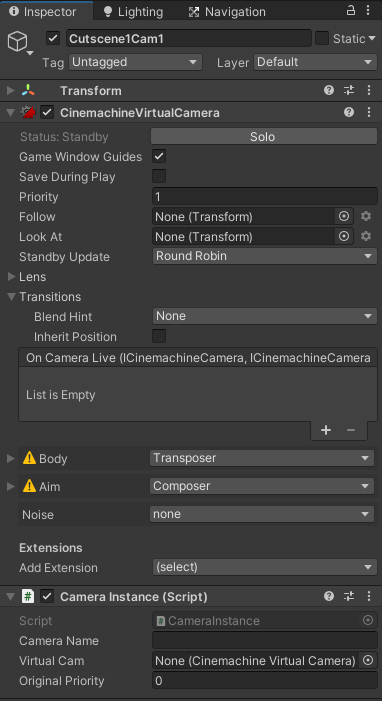
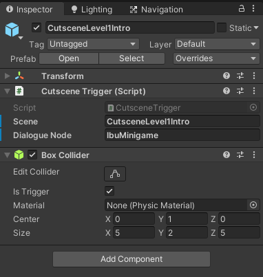

# Setup Guide Cutscene

Untuk setup satu cutscene dua hal utama yang perlu dibuat adalah, scene untuk menyimpan object yang dipakai di dalam cutscene, dan objek Cutscene Trigger yang akan memicu mulai cutscene.

## Scene object

Object-object yang ada di dalam cutscene ada dua jenis, `Virtual Camera` dan `Move Target`.

- Virtual Camera

  Game object yang berisi component `CinemachineVirtualCamera` dan script `Camera Instance`.
  
  Untuk menambahkan Virtual camera, buka menu `Cinemachine` di menu bar dan pilih `Create Virtual Camera`. Maka game object baru akan terbuat dengan component `CinemachineVirtualCamera` lalu tambahkan component `CameraInstance`.

  Untuk setup camera nya, silahkan baca di dokumentasi cinemachine atau cari tutorial tentang cinemachine.

  

  Untuk setup script `Camera Instance`;

  - `Camera Name` diisi dengan nama kamera yang akan dipanggil didalam command `switchCamera`. 
  - `Virtual Cam` diisi dengan component `CinemachineVirtualCamera` di object yang sama dan 
  - `Original Priority` diisi dengan prioritas kamera, isinya bebas asalkan dibawah 10. 
   
  Khusus untuk `Camera Name` dan `Virtual Cam` boleh dibiarkan kosong karena akan mengambil dari nama game object dan component yang ada di game object.

- Move Target
  
  Game object empty yang digunakan untuk referensi target gerak karakter untuk command `moveCharacter`.

  Setup untuk `Move Target` tidak terlalu banyak, hanya pengaturan `transform.position` dan nama game object, karena akan dipanggil didalam command `moveCharacter` berdasarkan nama game objectnya.

## Cutscene Trigger

Cutscene trigger cara kerja nya mirip dengan quest trigger, saat player masuk kedalam area nya maka cutscene akan dijalankan.

Untuk Cutscene Trigger, setup dasarnya sudah ada dalam bentuk prefab `CutsceneTrigger` di [`Level/Prefabs`](../Level/Prefabs). 

Isi dari script CutsceneTrigger adalah:
`Scene`, diisi dengan nama cutscene yang akan diload saat memulai cutscene, dan
`Dialogue Node`, diisi dengan dialogue node yang akan dijalankan saat memulai cutscene. `Dialogue Node` ini sebenarnya opsional, tapi karena implementasi dari cutscene ini masih menggunakan dialogue script untuk memanggil command nya jadi tetap harus diisi.

Satu component lagi yaitu `Box Collider`. Setupnya cukup mudah, yaitu tinggal memperbesar atau memperkecil collder ini agar tidak bisa dihindari player saat cutscene ini perlu dijalankan.

Jika ingin cutscene langsung dimulai saat level dimulai, letakkan cutscene agar langsung kena oleh player dari saat load level.

