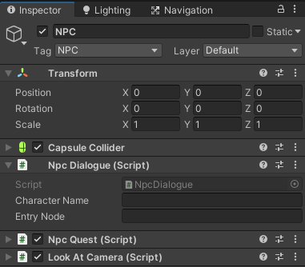

# Writing Guide untuk NPC Quest dan Dialogue

## Dialogue

File script dialog ditulis dalam file berformat `.yarn` di disimpan di dalam folder `Resources/Dialogue` dan dikelompokkan berdasarkan level dimana dialog tersebut dipakai

Disarankan menggunakan [Yarn Editor](https://github.com/YarnSpinnerTool/YarnEditor) untuk menulis script dialog karena sintaks dan terminologi nya sama dengan yang dipakai di project. Bisa pakai [Twine](https://twinery.org) tapi silahkan pelajari sendiri perbedaan sintaks dan terminologi nya.

Guide ini dipersingkat dan difokuskan kepada pemakaian yang spesifik ke project ini, untuk full guide nya bisa dilihat di halaman [Official Yarn Spinner Documentation](https://yarnspinner.dev/docs/writing/)

Satu set dialog dikelompokkan dalam sebuah `Node`. Satu node berisi satu konteks percakapan saja, jika berbeda konteks lebih baik dipisah ke node baru. Misalnya, karakter Ucup memiliki percakapan general di dalam node `Ucup` dan memiliki percakapan untuk quest di dalam node `UcupQuest`.

Penjelasan sintaks

### Line

Yang ditamilkan sebagai dialog yang diucapkan karakter.
```
Nama Karakter: Apa yang dikatakannya
```
Setiap line akan ditampilkan secara berurutan per baris.

### Options

Untuk menampilkan option pada dialog jika ditekan player makan akan menjalankan node yang disebutkan.
```
[[Teks Option|NamaNode]]
```

Normalnya, option dipakai untuk berpindah node. Tapi penggunaan option bisa dipersingkat dengan shortcut option,
```
-> Teks Option
    Karakter: Apa katanya?
```
dan untuk berpindah node bisa dilakukan dengan Jump, sitaks nya seperti option normal tapi hanya menyebutkan nama node nya saja.
```
[[NamaNode]]
```

Perlu diingat, walaupun shortcut lebih mudah dipakai tetap harus memperhatikan konteks dan kompleksitas dari dialog nya, apabila sudah masuk ke konteks lain atau percakapan menjadi terlalu kompleks tetap harus memakai sintaks option biasa.

Lengkapnya bisa dilihat di halaman [Controlling Dialogue](https://yarnspinner.dev/docs/writing/controlling/) di dokumentasi yarn spinner.


### Commands

Digunakan untuk mentrigger method-method tertentu melalui dialog

Yarn spinner memberikan dua built-in command `wait` untuk pause dialog selama waktu yang ditentukan (dalam satuan detik) dan `stop` untuk langsung keluar dari dialog. Diluar itu harus buat sendiri.

secara umum, sintaks untuk command adalah sebagai berikut
``` 
<<namaCommand GameObject Parameter dipisah oleh spasi>>
```

Command yang ada di project ini (akan terus diupdate sepanjang proses development)

- startQuest, untuk memulai quest dari NPC
  ```
  <<startQuest QuestManager QuestCode>>
  ```
- advanceQuestStage, untuk maju ke index stage quest yang disebutkan
  ```
  <<advanceQuestStage QuestManager QuestCode stage>>
  ```
- startMinigame, untuk memulai minigame. Command ini menunda dialogue sampai minigame diselesaikan
  ```
  <<startMinigame NamaPrefabMinigame>>
  ```

Guide lebih detail tentang penggunaan dan cara membuat custom command bisa dilihat di halaman [Working With Commands](https://yarnspinner.dev/docs/unity/working-with-commands/) di dokumentasi yarn spinner.

### Function

Seperti namanya, Function didefinisikan untuk bisa digunakan didalam yarn script. Biasanya function digunakan dengan [Expression dan if statement](https://yarnspinner.dev/docs/writing/expressions-and-variables/#expressions-and-if-statements)

Function yang ada di project ini (akan terus diopdate sepanjang proses development)

- questStage, menerima parameter string `questCode` dan integer `stageIndex`, untuk mengecek apakah sedang ada di stage quest tertentu.
  ```
  questStage("QuestCode", stageIndex)
  ```

Cara membuat function bisa dilihat dokumentasi untuk [DialogueRunner.AddFunction](https://yarnspinner.dev/api/yarn.unity/dialoguerunner/yarn.unity.dialoguerunner.addfunctionsystem.stringsystem.int32yarn.returningfunction/)

Referensi penulisan Yarn script di project ini bisa lihat file [Ucup.yarn](../Resources/Dialog/Level1/Ucup.yarn)

> Perhatian: Saat penulisan di Yarn Editor agar Yarn script nya bisa dicoba dijalankan, jangan dulu menggunakan Command dan Function yang ada di project. Sebagai alternatif bisa gunakan fitur variables yang diberikan oleh Yarn Spinner sebagai placeholder.


## Quest Data

File Quest Data ditulis dalam file berformat `.json` dan disimpan di dalam folder `Resources/Quest` dan dikelompokkan berdasarkan level dimana dialog tersebut dipakai

Suatu NPC bisa memiliki quest yang bisa diberikan ke player. Spesifikasi dari quest ini didefinisikan dalam class [QuestData](/Assets/Code/Scripts/Quest/QuestData.cs)

Untuk membuat sebuah quest, buat satu file `Quest.json` berisi definisi berikut

> `code` `string`: Nama yang dipakai untuk merujuk quest dalam kode
> 
> `name` `string`: Judul quest yang ditampilkan ke player
> 
> `startingType` `enum QuestStartingType`: Tipe pemicu mulai quest
> 
> `stages` `QuestStage[]`: Berisi stage/tahap progress quest yang bisa dilalui pemain.

Satu stage yang ada didalam array `stages`

> `title` `string`: Judul dari stage yang ditampilkan ke player setiap masuk ke stage baru
>
> `instruction` `string`: Instruksi tambahan untuk membantu player menyelesaikan stage
>
> `relatedNpc` `string`: NPC yang harus ditemui player untuk memulai atau menyelesaikan quest stage
> 
> `requirements` `string[]`: Hal-hal yang harus dimiliki player untuk menyelesaikan quest stage (fungsinya belum diimplementasi)
>
> `status` `enum QuestStatus`: Status yang menandakan implikasi stage terhadap quest

Tipe-tipe dalam `enum QuestStatus` adalah

> `0` `Inactive`: Menandakan quest tidak aktif atau belum dimulai
>
> `1` `TaskPending`: Menandakan quest aktif dan menunggu player menyelesaikan instruksi
>
> `2` `TaskDone`: Menandakan player telah selesai menyelesaikan instruksi dan menunggu player melapor ke NPC
>
> `3` `Success`: Menandakan quest selesai dengan status sukses
>
> `4` `Fail`: Menandakan quest selesai dengan status gagal

Tipe-tipe dalam `enum QuestStartingType` adalah

> `0` `Instant`: Quest dimulai langsung saat level dimulai
>
> `1` `Triggered`: Quest dimulai dengan trigger yang dilewati player saat bermain
 
didalam asset quest data `status` dan `startingType` ditulis dengan value angka nya

Tata cara penulisan file `.json` bisa lihat halaman [TutorialsPoint | JSON - Quick Guide](https://www.tutorialspoint.com/json/json_quick_guide.htm)

Referensi penulisan Quest Data bisa lihat file [UcupQuest.json](../Resources/Quest/Level1/UcupQuest.json)

## Menyatukan semuanya dalam satu scene

Untuk menyatukan dialogue dan quest dalam satu scene ada dua hal yang harus dilakukan,

Pertama, setup NPC,
- Ambil prefab `NPC` di folder [`Level/Prefabs`](../Level/Prefabs) masukkan kedalam scene, terserah secara langsung atau ke Hierarchy.
- Buka GameObject NPC di Inspector

  
- Rename GameObject dan isi `Character Name` sesuai nama karakter,
  
  Drop file dialog `.yarn` di `Dialogue Script`

  Isi `Entry Node` dengan nama node yang ingin dieksekusi ketika memulai percakapan dengan NPC, biasanya sama dengan nama NPC

  Didalam prefab `NPC` sudah ada script `NpcQuest`, script ini digunakan untuk manage quest marker yang tampak diatas NPC. Jika NPC tidak punya quest script ini bisa diremove.

Kedua, menambahkan quest data ke `QuestManager`,
- Di Hierarchy, cari gameobject `QuestManager`, di dalam prefab `Quest`, gameobject ini bertanggungjawab sebagai manager tersentralisasi dari semua quest yang ada di satu level.

  
- didalam array `Quest Files` tambahkan path ke file quest
 
Setelah semua lengkap, ketika dijalankan game nya dan kita menghampiri NPC tersebut maka player bisa berinteraksi dengan nya, ditandai dengan munculnya tombol Interact.

Berikut contoh gameobject `NPC` dan `QuestManager` yang sudah terisi


