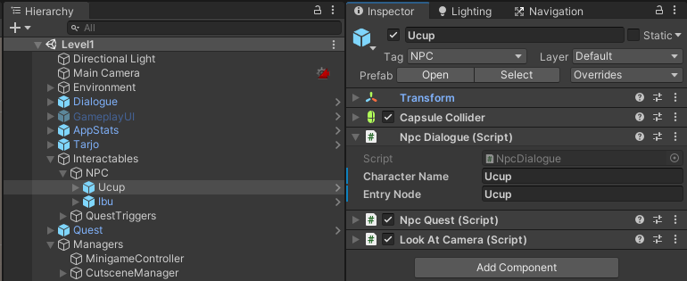

# Writing guide Dialogue

File script dialog ditulis dalam file berformat `.yarn` di disimpan di dalam folder `Resources/Dialogue` dan dikelompokkan berdasarkan level dimana dialog tersebut dipakai

Disarankan menggunakan [Yarn Editor](https://github.com/YarnSpinnerTool/YarnEditor) untuk menulis script dialog karena sintaks dan terminologi nya sama dengan yang dipakai di project. Bisa pakai [Twine](https://twinery.org) tapi silahkan pelajari sendiri perbedaan sintaks dan terminologi nya.

Guide ini dipersingkat dan difokuskan kepada pemakaian yang spesifik ke project ini, untuk full guide nya bisa dilihat di halaman [Official Yarn Spinner Documentation](https://yarnspinner.dev/docs/writing/)

Satu set dialog dikelompokkan dalam sebuah `Node`. Satu node berisi satu konteks percakapan saja, jika berbeda konteks lebih baik dipisah ke node baru. Misalnya, karakter Ucup memiliki percakapan general di dalam node `Ucup` dan memiliki percakapan untuk quest di dalam node `UcupQuest`.

Penjelasan sintaks

## Line

Yang ditampilkan sebagai dialog yang diucapkan karakter.
```
Nama Karakter: Apa yang dikatakannya
```
Setiap line akan ditampilkan secara berurutan per baris.

## Options

Untuk menampilkan option pada dialog jika ditekan player makan akan menjalankan node yang disebutkan.
```
[[Teks Option|NamaNode]]
```

Normalnya, option dipakai untuk berpindah node. Tapi penggunaan option bisa dipersingkat dengan shortcut option,
```
-> Teks Option
    Karakter: Apa katanya?
```
dan untuk berpindah node bisa dilakukan dengan Jump, sitaks nya seperti option normal tapi hanya menyebutkan nama node nya saja.
```
[[NamaNode]]
```

Perlu diingat, walaupun shortcut lebih mudah dipakai tetap harus memperhatikan konteks dan kompleksitas dari dialog nya, apabila sudah masuk ke konteks lain atau percakapan menjadi terlalu kompleks tetap harus memakai sintaks option biasa.

Lengkapnya bisa dilihat di halaman [Controlling Dialogue](https://yarnspinner.dev/docs/writing/controlling/) di dokumentasi yarn spinner.


## Commands

Digunakan untuk mentrigger method-method tertentu melalui dialog

Yarn spinner memberikan dua built-in command `wait` untuk pause dialog selama waktu yang ditentukan (dalam satuan detik) dan `stop` untuk langsung keluar dari dialog. Diluar itu harus buat sendiri.

secara umum, sintaks untuk command adalah sebagai berikut
``` 
<<namaCommand GameObject Parameter dipisah oleh spasi>>
```

Command yang ada di project ini (akan terus diupdate sepanjang proses development)

- startQuest, untuk memulai quest dari NPC
  ```
  <<startQuest QuestManager QuestCode>>
  ```
- advanceQuestStage, untuk maju ke index stage quest yang disebutkan
  ```
  <<advanceQuestStage QuestManager QuestCode stage>>
  ```
- startMinigame, untuk memulai minigame. Command ini menunda dialogue sampai minigame diselesaikan
  ```
  <<startMinigame NamaPrefabMinigame>>
  ```
- moveCharacter, untuk menggerakkan karakter ke satu titik tertentu
  ```
  <<moveCharacter NamaKarakter NamaTarget metodeGerak>>
  ```
  `metodeGerak` memiliki dua opsi:
  - `teleport`, untuk memindahkan karakter secara instan, dan 
  - `walk`, untuk membuat karakter 'berjalan'.
- switchCamera, untuk 'mengganti' sudut pandang kamera dengan cara pindah ke instance `Cinemachine Virtual Camera` yang ditentukan.
  ```
  <<switchCamera NamaKamera MetodeTransisi>>
  ```
  `MetodeTransisi` dibuat berdasarkan class [`CinemachineBlendDefinition.Style`](https://docs.unity3d.com/Packages/com.unity.cinemachine@2.3/api/Cinemachine.CinemachineBlendDefinition.Style.html?q=cinemachineblen), tapi baru ada dua opsi sudah diimplementasi; `Cut` dan `EaseIn`.
  
- switchToPlayerCamera, setelah selesai berpindah-pindah kamera didalam cutscene, pakai command ini untuk kembali ke kamera yang megikuti player.
  ```
  <<switchToPlayerCamera>>
  ```

Guide lebih detail tentang penggunaan dan cara membuat custom command bisa dilihat di halaman [Working With Commands](https://yarnspinner.dev/docs/unity/working-with-commands/) di dokumentasi yarn spinner.

## Function

Seperti namanya, Function didefinisikan untuk bisa digunakan didalam yarn script. Biasanya function digunakan dengan [Expression dan if statement](https://yarnspinner.dev/docs/writing/expressions-and-variables/#expressions-and-if-statements)

Function yang ada di project ini (akan terus diopdate sepanjang proses development)

- questStage, menerima parameter string `questCode` dan integer `stageIndex`, untuk mengecek apakah sedang ada di stage quest tertentu.
  ```
  questStage("QuestCode", stageIndex)
  ```

Cara membuat function bisa dilihat dokumentasi untuk [DialogueRunner.AddFunction](https://yarnspinner.dev/api/yarn.unity/dialoguerunner/yarn.unity.dialoguerunner.addfunctionsystem.stringsystem.int32yarn.returningfunction/)

Referensi penulisan Yarn script di project ini bisa lihat file [Ucup.yarn](../Resources/Dialog/Level1/Ucup.yarn) dan [Ibu.yarn](../Resources/Dialog/Level1/Ibu.yarn)

> Perhatian: Saat penulisan di Yarn Editor jika ingin Yarn script nya bisa dicoba dijalankan langsung, jangan dulu menggunakan Command dan Function yang ada di project. Sebagai alternatif bisa gunakan fitur variables yang diberikan oleh Yarn Spinner sebagai placeholder.

## Memasukkan dialogue ke dalam scene

Untuk memasukkan dialogue ke dalam scene ada dua hal yang harus dilakukan,

Pertama, tambahkan dialog ke `DialogueManager` untuk diload saat scene di play.


Kedua, setup NPC,
- Ambil prefab `NPC` di folder [`Level/Prefabs`](../Level/Prefabs) masukkan kedalam scene, terserah secara langsung atau ke Hierarchy.
- Buka GameObject NPC di Inspector

  

- Rename GameObject dan isi `Character Name` sesuai nama karakter,

  Isi `Entry Node` dengan nama node yang ingin dieksekusi ketika memulai percakapan dengan NPC, biasanya sama dengan nama NPC

  Didalam prefab `NPC` sudah ada script `NpcQuest`, script ini digunakan untuk manage quest marker yang tampak diatas NPC. Jika NPC tidak punya quest script ini bisa diremove atau dinonaktifkan.

  Berikut contoh gameobject `NPC` yang sudah terisi

  Setelah semua lengkap, ketika dijalankan game nya dan kita menghampiri NPC tersebut maka player bisa berinteraksi dengan nya, ditandai dengan munculnya tombol Interact.
 
  

