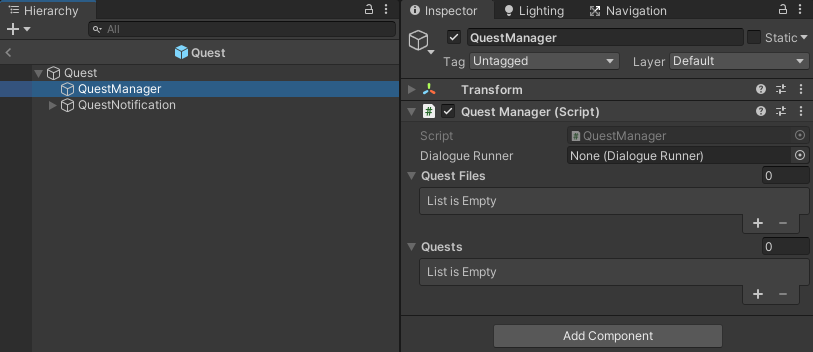
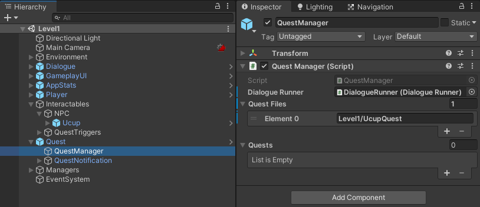
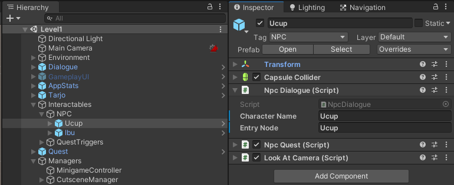

# Writing guide Quest

## Membuat Quest Data

File Quest Data ditulis dalam file berformat `.json` dan disimpan di dalam folder `Resources/Quest` dan dikelompokkan berdasarkan level dimana dialog tersebut dipakai

Suatu NPC bisa memiliki quest yang bisa diberikan ke player. Spesifikasi dari quest ini didefinisikan dalam class [QuestData](/Assets/Code/Scripts/Quest/QuestData.cs)

Untuk membuat sebuah quest, buat satu file `Quest.json` berisi definisi berikut

> `code` `string`: Nama yang dipakai untuk merujuk quest dalam kode
>
> `name` `string`: Judul quest yang ditampilkan ke player
>
> `startingType` `enum QuestStartingType`: Tipe pemicu mulai quest
>
> `stages` `QuestStage[]`: Berisi stage/tahap progress quest yang bisa dilalui pemain.

Satu stage yang ada di dalam array `stages`

> `title` `string`: Judul dari stage yang ditampilkan ke player setiap masuk ke stage baru
>
> `instruction` `string`: Instruksi tambahan untuk membantu player menyelesaikan stage
>
> `relatedNpc` `string`: NPC yang harus ditemui player untuk memulai atau menyelesaikan quest stage
>
> `requirements` `string[]`: Hal-hal yang harus dimiliki player untuk menyelesaikan quest stage (fungsinya belum diimplementasi)
>
> `status` `enum QuestStatus`: Status yang menandakan implikasi stage terhadap quest

Tipe-tipe dalam `enum QuestStatus` adalah

> `0` `Inactive`: Menandakan quest tidak aktif atau belum dimulai
>
> `1` `TaskPending`: Menandakan quest aktif dan menunggu player menyelesaikan instruksi
>
> `2` `TaskDone`: Menandakan player telah selesai menyelesaikan instruksi dan menunggu player melapor ke NPC
>
> `3` `Success`: Menandakan quest selesai dengan status sukses
>
> `4` `Fail`: Menandakan quest selesai dengan status gagal

Tipe-tipe dalam `enum QuestStartingType` adalah

> `0` `Instant`: Quest dimulai langsung saat level dimulai
>
> `1` `Triggered`: Quest dimulai dengan trigger yang dilewati player saat bermain

didalam asset quest data `status` dan `startingType` ditulis dengan value angka nya

Tata cara penulisan file `.json` bisa lihat halaman [TutorialsPoint | JSON - Quick Guide](https://www.tutorialspoint.com/json/json_quick_guide.htm)

Referensi penulisan Quest Data bisa lihat file [UcupQuest.json](../Resources/Quest/Level1/UcupQuest.json)

## Quest Trigger

Untuk memicu mulai, atau progress, quest diluar dialog ada object `QuestTrigger`. Quest trigger akan memicu mulai quest saat player melangkah ke area dimana quest trigger ini ditempatkan.

## Memasukkan quest ke dalam scene

Pertama, menambahkan quest data ke `QuestManager`,

- Di Hierarchy, cari gameobject `QuestManager`, di dalam prefab `Quest`, gameobject ini bertanggungjawab sebagai manager tersentralisasi dari semua quest yang ada di satu level.

  
- didalam array `Quest Files` tambahkan path ke file quest

Kedua, masukkan dan atur `NPC` yang berhubungan dengan quest.

Setelah semua lengkap, ketika dijalankan game nya dan ada quest yang sedang aktif, NPC yang berhubungan dengan quest stage dari quest aktif tersebut tersebut akan menampilkan quest marker diatas nya.

Berikut contoh gameobject `QuestManager` dan `NPC` yang sudah terisi

